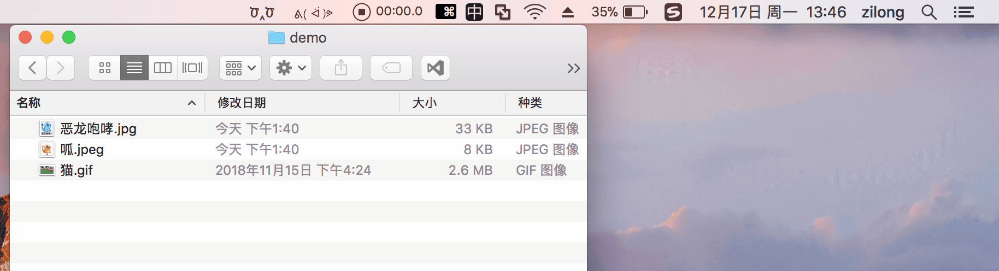
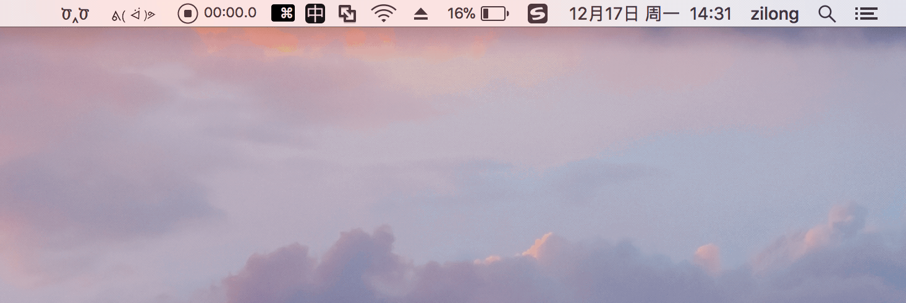

# oxo

## 介绍

oxo 是一个用于上传图片的 MacOS 应用

## Finder 上传

你可以从 Finder 中选中待上传的图片，直接使用快捷键 `Command + U` 上传

## 截图上传

一般的截图上传过程，你会经历以下步骤：

`截图` -> `下载到本地` -> `打开上传网站` -> `上传` -> `复制链接` -> `End`

而有了oxo，你可以跳过一系列繁琐的步骤

> __Note__: 由于 gif 录制软件的问题，截图时的轮廓线并没有被录制进去，实际框选的时候是有轮廓线的

## 剪贴板上传

你也可以上传剪贴板中的图片

## 拷贝模式

oxo 提供了两种拷贝模式：`Default` / `Markdown`

前者只复制图片地址，后者会应用 Markdown 语法，为你带来流畅的 Markdown 书写体验

示例：

> __Info__: Default: `https://image.url`

---

> __Info__: Markdown: ``

## 下载

## 感谢

因为 [ipic](https://github.com/toolinbox/iPic) 无法满足日常需要，而且部分功能收费，才有了 oxo

oxo 的诞生离不开 ipic，ipic 的交互给 oxo 带来了很多启发

**在此表示感谢！**
